# AACX

Welcome to AACX, a playful exploration of various technologies and concepts through a simple yet engaging video game.

AACX delves into the following technologies and concepts:

1. Django channels
1. HTMX
1. Hypermedia-driven UI: the server sends HTML, over HTTP and websockets
1. View Transitions.


## Setup

Let's get started with setting up and running the application.

1. **Requirements**:
    Ensure you have the following dependencies installed:
   - docker

2. **Start the project**:
   - Open a terminal in the root directory of your project.
   - Execute the following command to initiate the project setup:
        
        ```bash
        docker compose up
        ```
   - If `db` fails with "database files are incompatible with server", the `pgdata` volume was created by a different PostgreSQL major version. Reset it with `docker compose down -v`.

3. **Populate the Database**:
    The database is automatically created and populated with necessary data.

## Getting Started

To embark on your gaming journey, simply open your browser and navigate to http://localhost:8000/home/ (nothing is served at `/`). You'll be asked for a nickname: pick any free one and you're in. The nickname stays tied to that browser, see [ADR 0003](docs/adr/0003-passwordless-nickname-login.md).

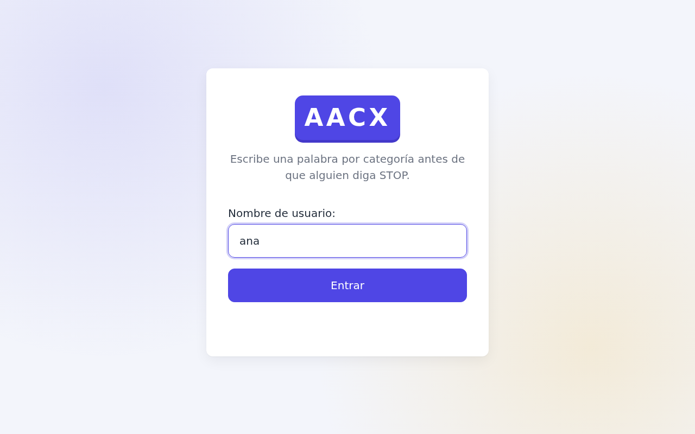

### home page

Explore existing parties or create your own.

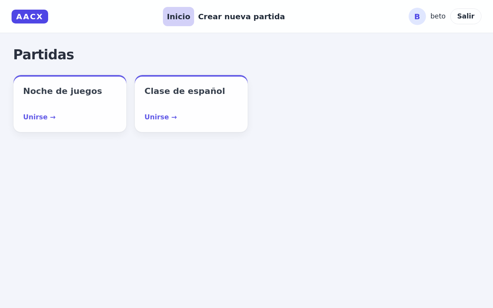

### Create a new party

Personalize your party by giving it a unique name or adjusting its settings to your liking.

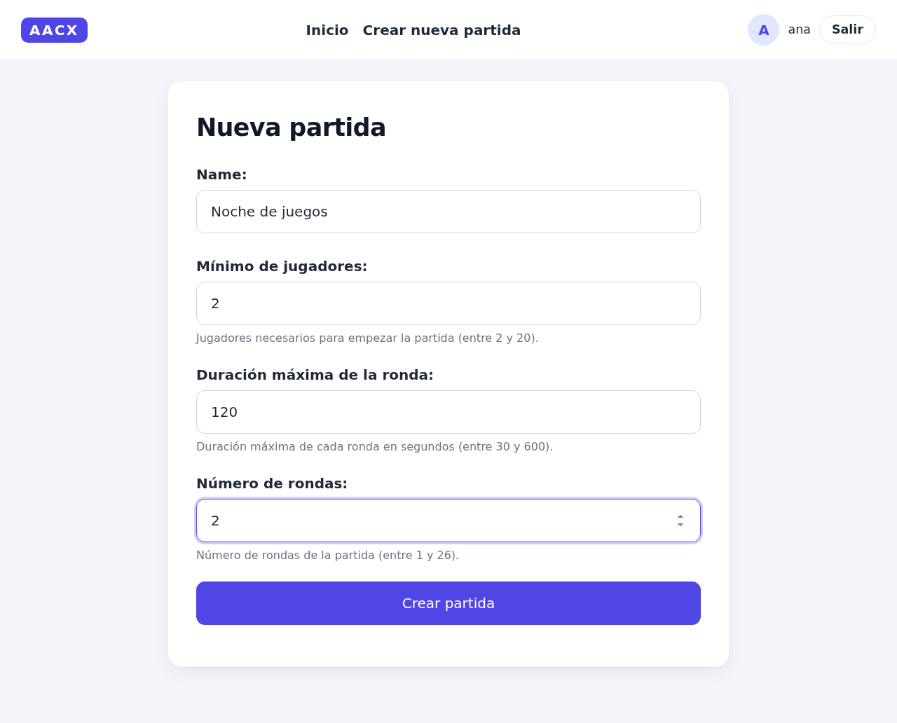

Upon successful creation, a confirmation message will appear

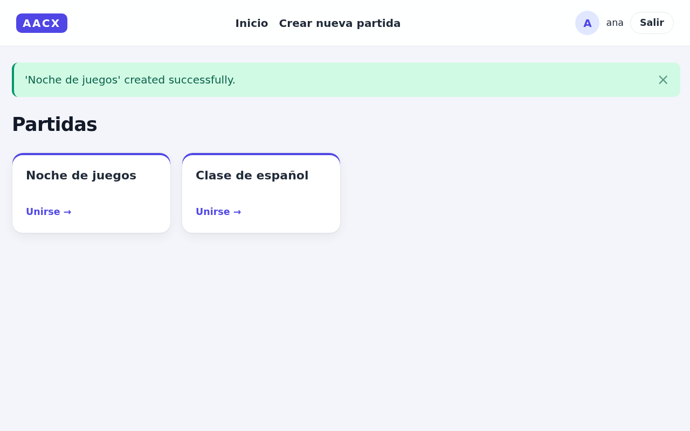

### Join a party

Simply click on a party to join. Depending on the settings, you may need to wait for other players to join before starting (you can change the minimum number of players when creating the party).

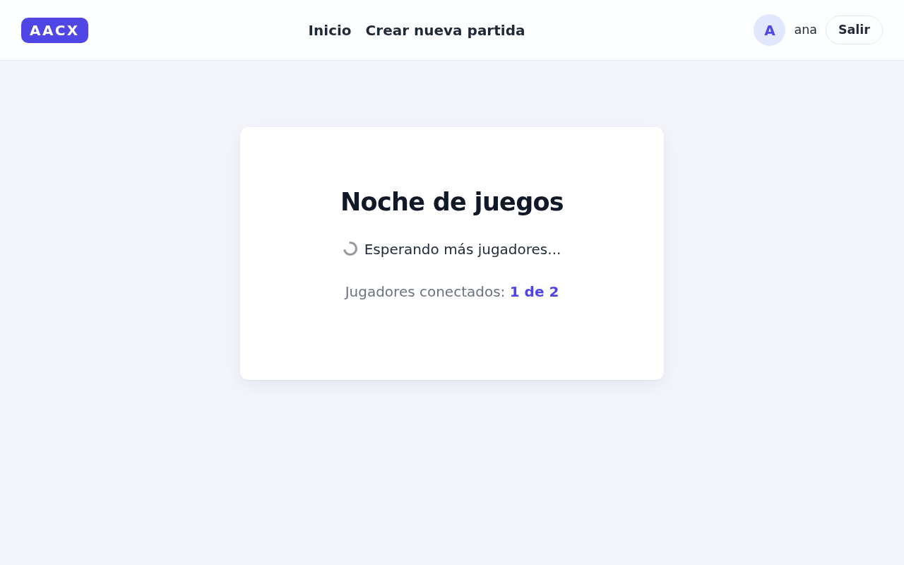

### Gameplay

Once the party begins, your task is to provide answers for each round, starting with the designated letter. Track your progress, view other players' scores, and their answers too.

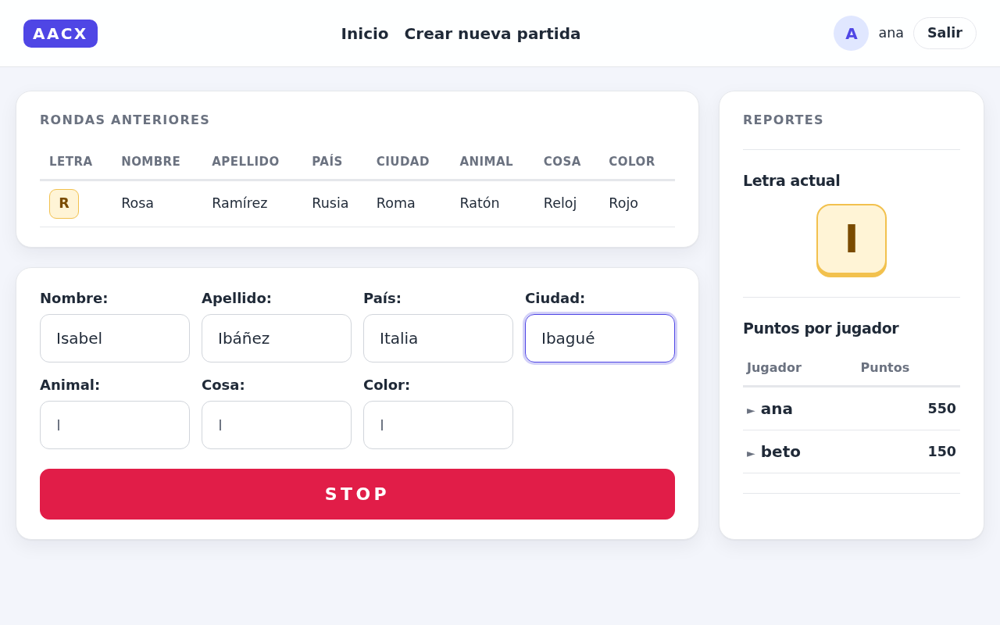

The game screen also works on phones.

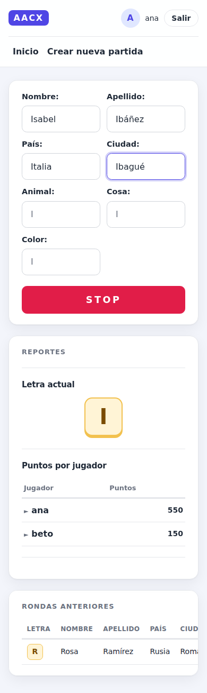

Incorrect answers will be highlighted for your attention.

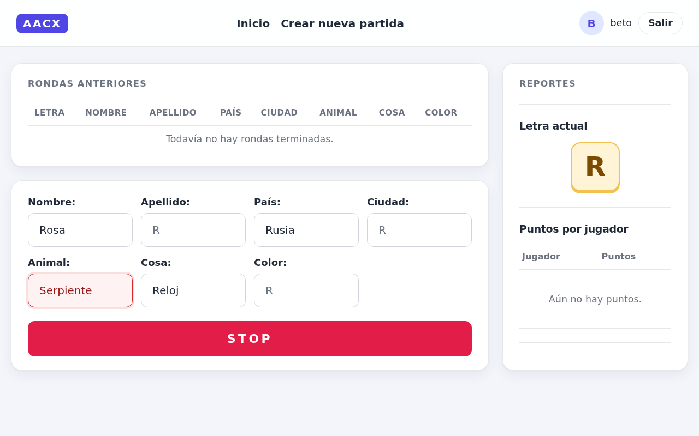

When a round ends, either due to timeout or player intervention, all answers will be revealed, and scores updated.

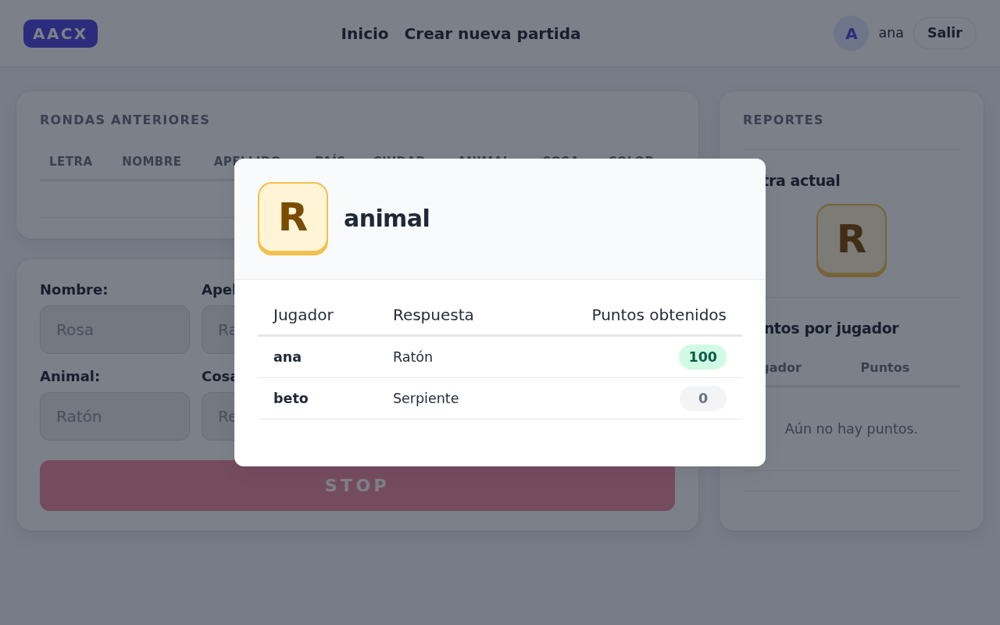

Click a player in the scores table to see their answers from past rounds.

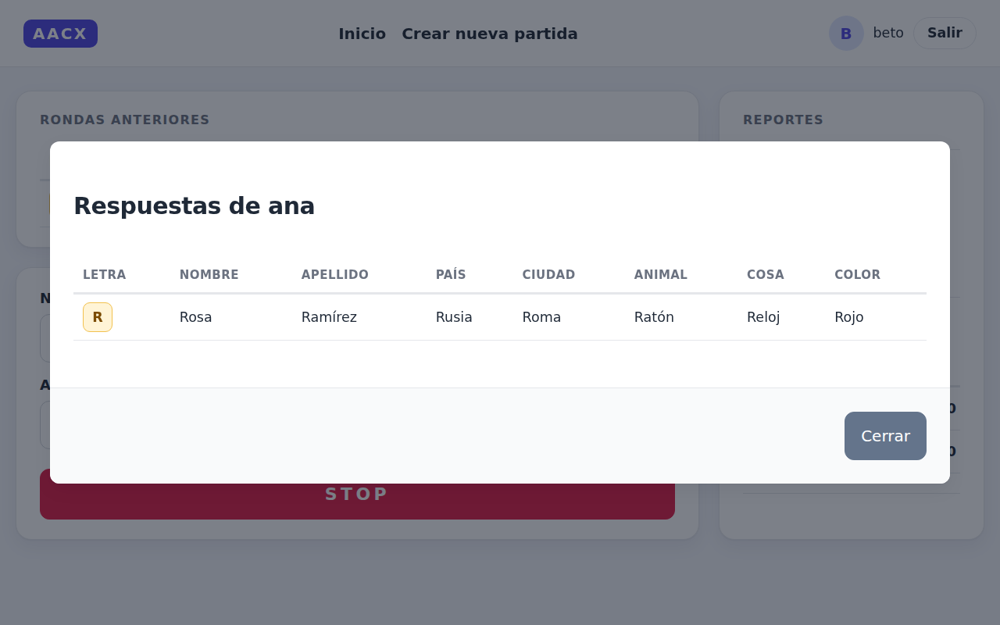

When the last round ends, the winners are announced.

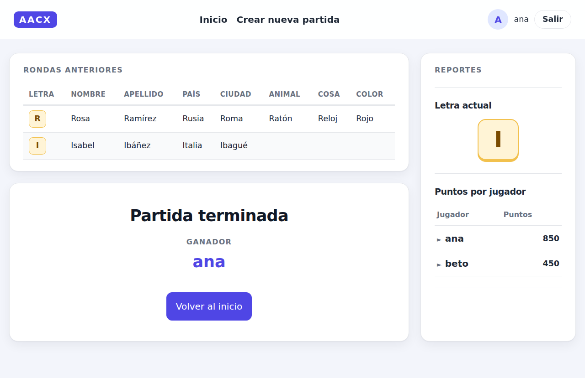

### Updating the screenshots

`scripts/screenshots.py` regenerates every image above with Playwright: two players log in, create a party, play two rounds and see the final results. Run it against a fresh database:

```bash
docker compose down -v && docker compose up -d
uv run scripts/screenshots.py
```

## Testing

The test suite uses pytest, pytest-django and the Channels testing tools, and runs against Postgres.

Run it inside Docker:

```bash
docker compose run --rm server pytest
```

Or locally with Python 3.11, pointing the tests at any Postgres and Redis instances:

```bash
pip install -r requirements-dev.txt
docker run -d --name aacx-test-db -p 5432:5432 \
    -e POSTGRES_USER=django_user -e POSTGRES_PASSWORD=django_password postgres:16
docker run -d --name aacx-test-redis -p 6379:6379 redis:7
POSTGRES_HOST=localhost POSTGRES_PORT=5432 REDIS_HOST=localhost REDIS_PORT=6379 pytest
```

Tests use `asacx/settings_test.py`, which swaps Redis for an in-memory channel layer and cache. Party leases still need a real Redis.

## Production

`docker build .` builds the production image: it runs `collectstatic` at build time and serves the app with `daphne asacx.asgi:application` on port 8000. Run the Channels workers from the same image with `python manage.py custom_runworker '*'`, one of them with `CHANNELS_WORKER_MASTER=1`.

Settings are read from environment variables. `docker compose` uses the `dev` stage of the `Dockerfile`, which sets `DJANGO_DEBUG=true`, so the defaults below work locally without a `.env`.

| Variable | Default | Notes |
|---|---|---|
| `DJANGO_SECRET_KEY` | dev-only key when `DJANGO_DEBUG` is on | Required otherwise. |
| `DJANGO_DEBUG` | `false` | Also enables `debug_toolbar`, `django_extensions` and `/__debug__/`. |
| `DJANGO_ALLOWED_HOSTS` | empty | Comma-separated. Websocket origins are checked against it too. |
| `CSRF_TRUSTED_ORIGINS` | empty | Comma-separated, with scheme, e.g. `https://aacx.example.com`. |
| `DATABASE_URL` | `postgres://django_user:django_password@db:5432/django_db` | |
| `REDIS_URL` | `redis://cache:6379/0` | Channels layer. |
| `REDIS_CACHE_URL` | `redis://cache:6379/1` | Django cache. Keep it on a different database than `REDIS_URL`, `cache.clear()` flushes the whole database. |
| `LEASE_REDIS_URL` | `REDIS_CACHE_URL` | Party leases held by the Channels workers. |
| `DJANGO_HTTPS` | `false` | Redirects to HTTPS, marks cookies secure and sends HSTS. |
| `DJANGO_HSTS_SECONDS` | one year | Only with `DJANGO_HTTPS`. |
| `DJANGO_BEHIND_TLS_PROXY` | `false` | Trust `X-Forwarded-Proto: https` from the proxy that terminates TLS. Only enable it if that proxy overwrites the header. |
| `CLIENT_IP_HEADER` | unset | See [ADR 0003](docs/adr/0003-passwordless-nickname-login.md). |
| `CHANNELS_WORKER_MASTER` | `false` | See [Architecture overview](docs/architecture.md). |

With `DJANGO_SECRET_KEY`, `DJANGO_ALLOWED_HOSTS` and `DJANGO_HTTPS=true` set, `python manage.py check --deploy` reports no issues.

## Architecture

- [Architecture overview](docs/architecture.md): runtime topology, message flow between Daphne, `PartyConsumer`, `PartyStateMachine`, Redis and Postgres, the party lifecycle, the data model and the frontend model.
- [Architecture decision records](docs/adr/README.md).

## Project decisions:
In developing AACX, several key decisions were made. The ones that shape the architecture are recorded as [ADRs](docs/adr/README.md):

1. Utilization of Django: Leveraging Django's MVC architecture and template system for maximal synergy with HTMX.
1. Integration of Django Channels: Exploring real-time operations via websockets in Python, diverging from the conventional Node.js or Golang implementations.
1. Adoption of HTMX: Experimenting with HTMX to create richly interactive pages with minimal JavaScript.
1. Incorporation of View Transitions: Embracing Google Chrome's new view transitions as a potential future standard for web pages, acknowledging the evolving landscape of web technologies.
1. While testing is typically a vital aspect of software development, it was approached differently in this project. Despite acknowledging its importance and usually prioritizing testing before code implementation, the nature of this project involved numerous new technologies and uncertain decisions. Therefore, testing was not conducted in the traditional sense. Instead, the development process was more of an experimental trial-and-error endeavor. Each decision was made cautiously, with constant exploration and adaptation to the evolving landscape of technologies.