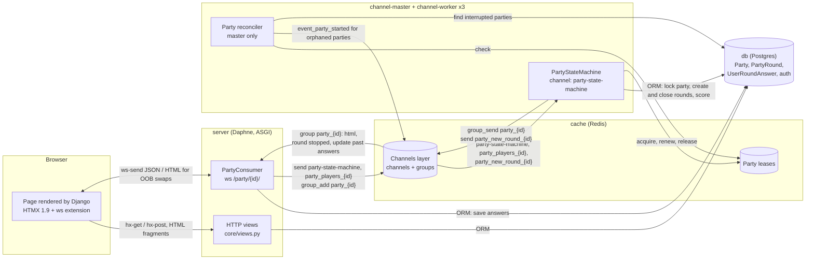
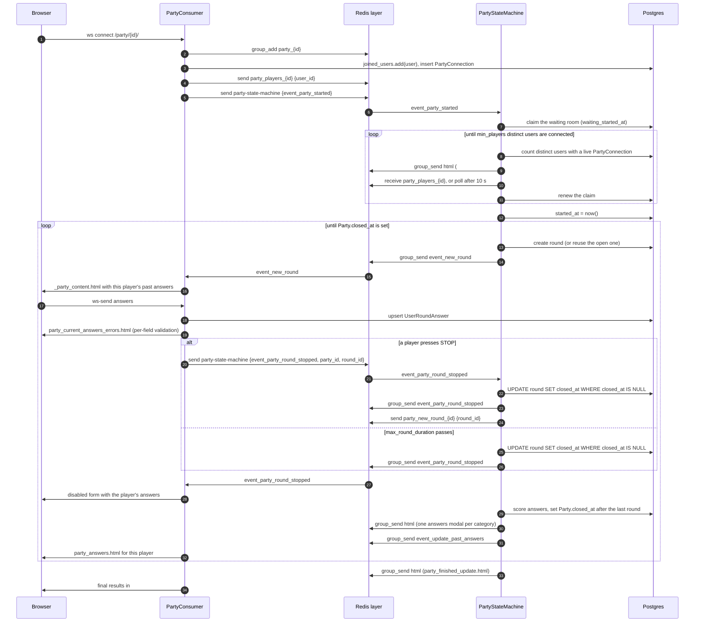
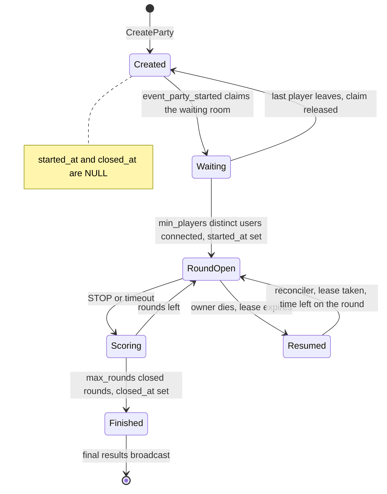
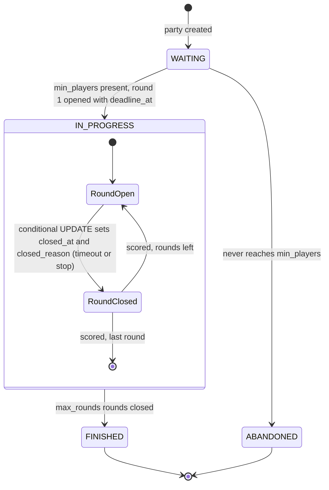
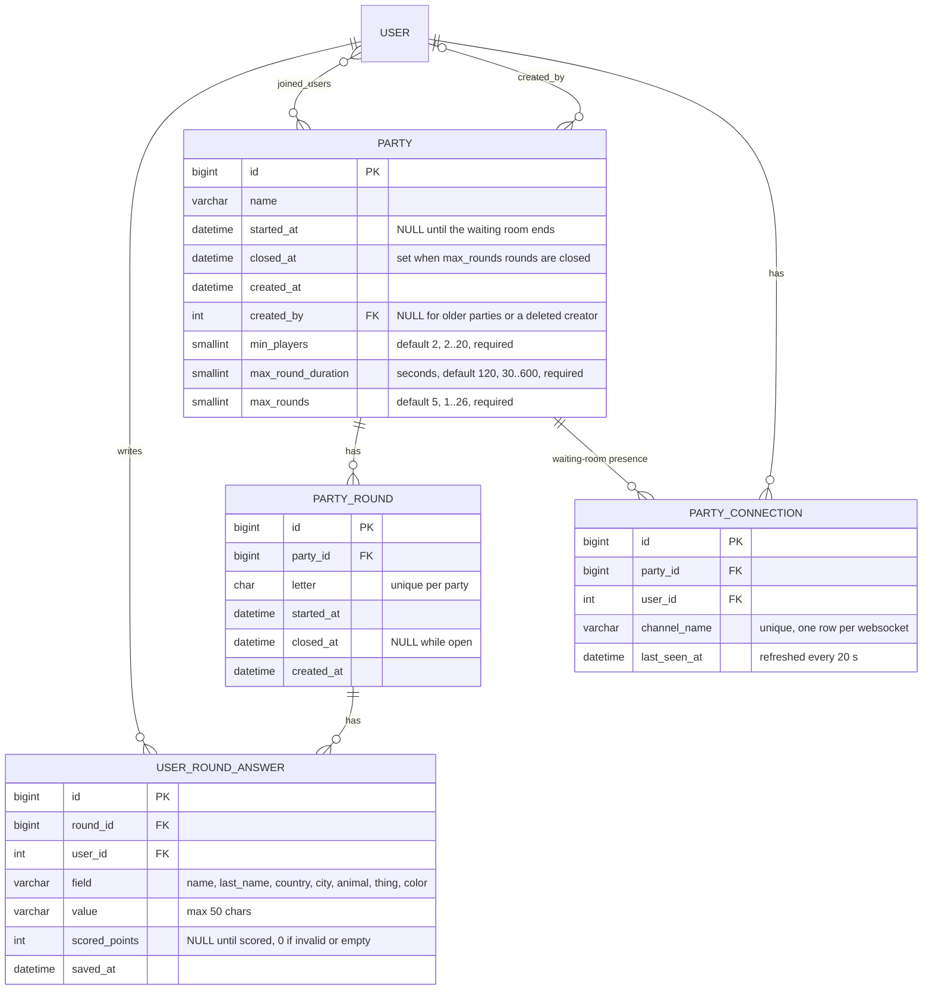

# AACX architecture

AACX is a multiplayer word game in the style of "Stop" (Basta, Tutti Frutti). Each round has a letter, and players race to fill seven categories (name, last name, country, city, animal, thing, color) with words that start with it. It is a single Django project (`asacx`) with one app (`core`). Django Channels handles the real-time part, and the UI is server-rendered HTML driven by HTMX.

Design decisions are recorded as ADRs in [`docs/adr/`](adr/README.md).

- [Runtime topology](#1-runtime-topology)
- [Component diagram](#2-component-diagram)
- [Event catalog](#3-event-catalog)
- [Party lifecycle](#4-party-lifecycle)
- [Data model](#5-data-model)
- [Frontend model](#6-frontend-model)
- [Known gaps](#known-gaps)

## 1. Runtime topology

`docker compose up` starts one image (`asacx`, built from the `Dockerfile`) in several roles, plus Redis and Postgres. The app containers share the `x-app` settings: they bind-mount the repository at `/app`, restart `unless-stopped`, and only start once `db` and `cache` are healthy and `migrate` has exited successfully.

| Service | Runs | Role |
|---|---|---|
| `migrate` | `manage.py migrate --noinput`, once | Applies migrations before anything else starts, so no server or worker runs against an unmigrated database. |
| `server` | `manage.py runserver 0.0.0.0:8000` | Because `daphne` is in `INSTALLED_APPS`, `runserver` is Daphne's ASGI server. It serves HTTP views and the `PartyConsumer` websocket on port 8000. |
| `channel-master` | `watchmedo auto-restart ... manage.py custom_runworker *` with `CHANNELS_WORKER_MASTER=1` | Channels worker for the `party-state-machine` channel. It also runs the party reconciler, which resumes interrupted parties (see below). |
| `channel-worker` ×3 | Same as `channel-master`, with `CHANNELS_WORKER_MASTER=0` | Additional `party-state-machine` workers. They don't run the reconciler. |
| `cache` | `redis:7`, healthcheck `redis-cli ping` | Redis database 0 is the Channels layer (`channels_redis.core.RedisChannelLayer`). Database 1 is Django's cache (`redis_lock.django_cache.RedisCache`), which holds the per-IP nickname creation counters of `/login/` ([ADR 0003](adr/0003-passwordless-nickname-login.md)). Database 1 also holds the party leases (`LEASE_REDIS_URL`). |
| `db` | `postgres:16` with the `pgdata` volume, healthcheck `pg_isready` over TCP | Django's database. Some queries depend on Postgres (`.distinct("pk")` in the party views). |

**`custom_runworker *`**: `runworker` needs explicit channel names. `core/management/commands/custom_runworker.py` expands `*` to every key of `core.routing.channel_routing`, which is just `party-state-machine`.

**`CHANNELS_WORKER_MASTER`**: read into `settings.IS_CHANNELS_WORKER_MASTER`. When it is true, the `PartyWorker` of `custom_runworker` also runs the party reconciler next to its channel listeners. Every `RECONCILE_INTERVAL` (5 s), `resume_orphaned_parties` sends `event_party_started` for each party with `started_at` set, `closed_at` null and no live lease, so a party interrupted by a crash or a restart gets a runner again (see [Party lifecycle](#4-party-lifecycle)). It runs periodically, not once at startup, because a dead worker's lease only expires `PartyLease.TTL` seconds later. Only `channel-master` sets the flag. `CoreConfig.ready()` doesn't touch the database, so management commands such as `migrate` run no party queries.

**Worker concurrency**: a Channels worker runs one `PartyStateMachine` instance per channel and handles its messages one at a time. `event_party_started` doesn't return until the party is over, so a running party takes a whole worker. A busy worker also keeps receiving from `party-state-machine` and queues those messages in memory. A STOP, or another party's `event_party_started`, can therefore land on a worker that is running a party and wait until that party ends, even when other workers are idle. By then its round has timed out, so the STOP is ignored as stale ([#9]).

## 2. Component diagram

`asacx/asgi.py` routes by protocol. `http` goes to the Django app. `websocket` goes through `AllowedHostsOriginValidator` and `AuthMiddlewareStack` to `core.routing.websocket_urlpatterns` (`party/<int:party_id>/` → `PartyConsumer`). `channel` goes through `ChannelNameRouter` to `core.routing.channel_routing` (`party-state-machine` → `PartyStateMachine`).

### HTTP routes

| Route | View | Notes |
|---|---|---|
| `/login/` | `Login` | Nickname login ([ADR 0003](adr/0003-passwordless-nickname-login.md)). |
| `/logout/` | `Logout` | A `LogoutView` restricted to POST (`http_method_names = ["post", "options"]`). Redirects to `/login/`. |
| `/home/` | `Home` | Parties the user can join or rejoin. This is the entry page. Nothing is routed at `/`, so it returns 404. |
| `/party/create/` | `CreateParty` | Live-validated form. Creates a new party when `submit=true`. It never modifies an existing one. |
| `/party/<id>/` | `DetailParty` | Waiting page, game page, or final results once the party is closed. A user who didn't join a started party gets the read-only `party_started.html` ("Esta partida ya empezó", the scores and a link home) instead. The GET is read-only: it shows the latest round filled with the player's saved answers, disabled once it is closed, and a waiting state until the state machine opens the first one. |
| `/party/<id>/user/<username>/answers` | `PartyAnswers` | A player's answers, shown in a modal. Another player's answers only cover closed rounds. Returns 404 unless that user joined or answered in the party. |
| `/admin/`, `/__debug__/` | Django admin, debug toolbar | |

## 3. Event catalog

All messages go through the Redis channel layer and are serialized with msgpack, so every payload value has to be a primitive ([#4]). There are two kinds of address:

- **Channels** are point-to-point queues. `party-state-machine` is routed to worker consumers. The per-party channels are read directly with `channel_layer.receive(name)` from inside the running `event_party_started` coroutine, so their messages have no `type`.
- **Groups** fan out to every `PartyConsumer` connected to a party. The `type` selects the consumer method.

`channels_redis` defaults apply: messages expire after 60 s, channel capacity is 100, and group membership expires after 24 h. `PartyConsumer.disconnect` calls `group_discard`, so only sockets of a server that died without disconnecting stay in a group until the membership expires.

### Channel `party-state-machine`

Consumed by `PartyStateMachine` in whichever worker receives the message first. Busy workers receive too (see [Worker concurrency](#1-runtime-topology)).

| `type` | Payload | Producer | Handler behavior |
|---|---|---|---|
| `event_party_started` | `party_id`, `party_name` | `PartyConsumer.connect` on every connection to a party that isn't closed, and each waiting-room heartbeat while the party hasn't started. The party reconciler on the master, for started parties without a live lease. | Runs the whole party in its own task: waiting room, rounds and scoring (see [Party lifecycle](#4-party-lifecycle)). Only the worker that takes the party's lease runs it, the rest log "run by another worker" and return. A party that hasn't started also needs the waiting-room claim (step 1). A started party is resumed from the database. |
| `event_party_round_stopped` | `party_id`, `round_id` | `PartyConsumer.handle_form_submit` when a valid form has `submit_stop` | Closes the round with a conditional `UPDATE ... SET closed_at = now() WHERE closed_at IS NULL` (`PartyRoundQuerySet.aclose`). If the round was already closed, the STOP is logged and ignored, so duplicate STOPs are harmless. Otherwise it sends `event_party_round_stopped` to group `party_{id}` and `{round_id}` to `party_new_round_{id}`. |
| `event_party_join` | `party_id` | none | Unused handler ([#24]). |

`CreateParty.post` also sends `{"type": "party_stared", ...}` to `party_state_machine` (with underscores). Nothing reads that channel, so the message expires ([#24]).

### Channel `party_players_{id}`

| Payload | Producer | Consumer |
|---|---|---|
| `user_id` | `PartyConsumer`, when a connection to a party that hasn't started joins or leaves the waiting room | `PartyStateMachine.ensure_players_join` treats each message as a wake-up and recounts the players from `PartyConnection`. Messages sent after the party starts are never read. |

### Channel `party_new_round_{id}`

| Payload | Producer | Consumer |
|---|---|---|
| `round_id` | `PartyStateMachine.event_party_round_stopped`, after it closed the round | `PartyStateMachine.wait_for_round_end`, inside the round loop of `event_party_started`. It waits up to `max_round_duration` seconds. A message for the current round ends the wait early, and messages for other rounds are dropped as stale. On timeout it closes the round conditionally and, if that closed it, broadcasts `event_party_round_stopped`. |

### Group `party_{id}`

`PartyConsumer.connect` joins it and `disconnect` leaves it.

| `type` | Payload | Producer | `PartyConsumer` handler |
|---|---|---|---|
| `html` | `message`: HTML | `ensure_players_join` (waiting-room count), `display_all_answers` (one modal per category, then an empty modal), `finish_party` (`party_finished_update.html`) | `html`: forwards the HTML to the socket as-is. |
| `event_new_round` | `round_id` | `PartyStateMachine.next_round` | Renders `_party_content.html` for that round, with that user's past answers, the scores and the answers form filled with that user's saved answers. |
| `event_party_round_stopped` | none | State machine, by whichever path closed the round (timeout or STOP) | Renders `party_current_answers.html` disabled, pre-filled with that user's answers. |
| `event_update_past_answers` | none | `PartyStateMachine.update_scores` | Renders `party_answers.html` with that user's answers from every round. |

### Websocket messages

- **Browser → server**: the answers form uses `ws-send`, so each message is the form's fields as JSON plus a `HEADERS` object added by the htmx ws extension. `PartyConsumer.receive` only accepts messages where `HEADERS["HX-Trigger"]` is `party_current_answers_form` (autosave) or `submit_stop` (the STOP button). It validates them with `CurrentAnswersForm` and upserts every category, storing an empty value for a field that failed field validation (too long). Then it sends `event_party_round_stopped` if `submit_stop` is set, or replies with `party_current_answers_errors.html`, which holds only the per-field `#answer_error_<field>` elements.
- **Server → browser**: HTML fragments, swapped by element id (see [Frontend model](#6-frontend-model)). `connect` also sends the plain text `waiting for players to join`, which the ws extension ignores because it contains no element.

### Round sequence

## 4. Party lifecycle

### Implemented

The lifecycle has no explicit state. It is inferred from `Party.started_at`, `Party.closed_at` and each `PartyRound.closed_at`, and driven by one long coroutine, `PartyStateMachine.event_party_started`:

1. The waiting room. A worker claims the party with a conditional `UPDATE` of `waiting_started_at`, and `ensure_players_join` renews that claim at least every `WAITING_POLL_INTERVAL` (10 s). A claim older than `WAITING_CLAIM_TTL` (60 s) belongs to a dead worker and can be taken over. The party starts once `min_players` distinct users are connected at the same time. There is no deadline: the party never starts with fewer players, however long it waits. When the last player leaves, the worker releases the claim and stops waiting, and the party stays open to join. The next connection claims it again. Each connected player's heartbeat also re-sends `event_party_started`, so a waiting room whose worker died gets a new one once the claim expires. `started_at` is set with a conditional `UPDATE` that only succeeds for the current claim.
2. If the party is already closed, the handler returns. If it has already started, it is resumed: a latest round that is closed may have lost its runner before scoring, so it is scored again. Scoring is idempotent, and it closes the party after the last round.
3. While `Party.closed_at` is NULL:
   - `next_round` returns the open round, or creates one with an unused letter, and broadcasts it.
   - `wait_for_round_end` waits for a STOP on `party_new_round_{id}` or until the round's `started_at` plus `max_round_duration`, and makes sure the round is closed. A resumed round only gets the time it has left.
   - `update_scores` scores the round. The same transaction sets `Party.closed_at` once the party has `max_rounds` closed rounds.
4. `finish_party` broadcasts `party_finished_update.html`: the winners, the final scores and a link home.

Each party has a single owner: the worker that holds its `PartyLease` (`core/leases.py`), a `python-redis-lock` lock on `lock:party-lease:{id}` that expires after `TTL` (15 s). `run_party` takes it without blocking and runs the party through `PartyLease.run_while_held`, which renews the lease every `RENEW_INTERVAL` (5 s) from an asyncio task. If a renewal finds the lease gone, or Redis errors leave too little time before it would expire, the party task is cancelled before another worker can take over. The lease is released when the party ends or crashes, so duplicate `event_party_started` messages and restarts never start a second loop. As a second guard, `aget_current_or_next_round` and scoring lock the `Party` row, so a stale runner can't open a round next to the owner's or after the last one. When a worker dies, its lease expires and the reconciler sends `event_party_started` again. The worker that takes the lease resumes from the database: the open round keeps its letter and its deadline, and the stop condition counts closed rounds, so the party plays exactly `max_rounds` rounds.

### Target

The target is proposed in [#1] and recorded in [ADR 0004](adr/0004-persisted-event-driven-party-state-machine.md). State is persisted in `Party.status`, transitions are conditional DB updates, events carry ids only, and each party runs as its own `asyncio.Task` owned by one worker through a Redis lease.

After a worker restart, a reconciler resumes every `IN_PROGRESS` party that has no live lease. It picks up from the current round and the time left before `deadline_at`, and doesn't replay rounds that are already closed.

## 5. Data model

`USER` is `django.contrib.auth`'s `User`. Players get one with an unusable password the first time they log in ([ADR 0003](adr/0003-passwordless-nickname-login.md)).

### Invariants

- **Letters don't repeat.** `unique_together = ("party", "letter")`, so a party can have at most 26 rounds. `max_rounds` is capped at 26 for that reason. `aget_current_or_next_round` picks a random unused letter and raises `"All letters are used"` when none are left.
- **One answer per player, round and category.** `unique_together = ("round", "user", "field")`. `PartyRound.save_user_answers` upserts with `bulk_create(update_conflicts=True)`, so each autosave overwrites the previous value.
- **The current round** is the party's round with the latest `started_at`. It is open while `closed_at` is NULL. `aget_current_or_next_round` returns it if it is open and otherwise creates a new one, so only the state machine calls it. Callers that only need to read use `aget_current_round`.
- **A round is closed exactly once.** Every close is a conditional `UPDATE ... WHERE closed_at IS NULL` (`PartyRoundQuerySet.aclose`, or the one inside `close_round_and_calculate_scores`), and only the caller whose update wins broadcasts the round end.
- **A party is closed** once it has `max_rounds` closed rounds. `close_round_and_calculate_scores` sets `Party.closed_at` in the same transaction as the scores, with a conditional `UPDATE ... WHERE closed_at IS NULL`. Migration `0014_close_finished_parties` backfilled parties that had already played all their rounds. `Party.is_active` means `closed_at` is NULL.
- **A party has started** once `started_at` is set. It is set once, by the worker that holds the waiting-room claim.
- **`joined_users`** gets every user who connects to the party's websocket before it starts, so everyone who waited can play. After the start, only those users can connect. The HTTP views don't change it.
- **Waiting-room presence** is one `PartyConnection` row per websocket connected while the party waits. The consumer refreshes `last_seen_at` every `HEARTBEAT_INTERVAL` (20 s) and deletes the row on disconnect. Rows older than `TTL` (60 s) belong to dead connections: they aren't counted, and the next connection to that party deletes them. Players are counted as distinct users, so several tabs count once.
- **Available parties** (`PartyQuerySet.get_available_parties`) are parties that haven't started, plus unclosed parties the user joined. `DetailParty` and `PartyConsumer.can_join` share one policy, `Party.aget_access`: participants and anyone opening a party that hasn't started can play. A non-participant of a started party gets the read-only page and the websocket refuses them with 4403. A non-participant of a closed party gets a 404 and a 4403, even if the party never started.
- **Open party names are unique**, case-insensitively. The partial `UniqueConstraint` `unique_open_party_name` on `Lower(name)` where `closed_at IS NULL` enforces it, so a closed party's name can be reused. `CreateParty` always inserts a new party and records `created_by`. `PartyForm.clean_name` rejects a taken name with "Ya existe una partida abierta con ese nombre.", and the view shows the same error if the insert loses a race for the name. Migration `0016_party_created_by_unique_open_name` renamed open duplicates to `name (id)` before adding the constraint.
- **Party settings are required and bounded.** `min_players` (2..20), `max_round_duration` (30..600 seconds) and `max_rounds` (1..26) are non-null `PositiveSmallIntegerField`s, so the game loop can rely on them in `range()` and the round timeout. `PartyForm` rejects blank or out-of-range values with Spanish errors. Migration `0017_party_settings_not_null` backfilled NULLs with the defaults and clamped out-of-range rows into the bounds.

### Scoring

`PartyRound.close_round_and_calculate_scores` closes the round and scores it in one transaction, and closes the party after its last round. Each category is scored separately:

- An answer that is empty, or doesn't start with the round's letter, scores 0. The letter check ignores case and accents, but ñ is its own letter, so `Ñandú` doesn't count for N. Rounds scored before this rule kept `scored_points = NULL`, which is shown as 0.
- A valid answer scores `100 // n`, where `n` is the number of answers in that category with the same normalized value. A unique answer scores 100, two identical answers score 50 each, three score 33 each. `normalize_answer` ignores case, accents except the tilde on ñ, and surrounding or repeated whitespace, so `Perro`, `perro` and `perro ` are the same answer. The stored `value` is kept as typed.
- A player's party score is the sum of their `scored_points` over every round, with 0 for a player who has none (`Party.aget_players_scores`). The winners are every player with the top score, or nobody if the top score is 0 (`Party.aget_winners`).

`CurrentAnswersForm.clean` checks the initial letter while the player types, but it adds errors without removing the values, so invalid answers are stored anyway and score nothing when the round closes.

## 6. Frontend model

The UI is Django templates plus HTMX, with no custom JavaScript ([ADR 0001](adr/0001-server-rendered-html-with-htmx-over-websockets.md)). HTMX 1.9.12 and its `ws` extension are vendored in `core/static/js/`. The `debug` extension only loads when `settings.DEBUG` is on.

### Partial rendering (`base_template`)

Every page template starts with ``. `HTMXPartialMixin` (`core/views.py`) sets the context variable:

- On an HTMX request (`request.htmx`, from `django-htmx`), `base_template` is `base_partial.html`. That renders only the flash messages and the `content` block.
- Otherwise it is `base.html`, the full page: navbar, `<main id="content">` and an empty `
`.

The same URL therefore works both as a full page load and as an HTMX fragment. Navbar and party links use `hx-get` with `hx-target="#content"`, `hx-swap="innerHTML transition:true"` and `hx-push-url="true"`. `#content` has the `slide-it` class, which gives it a `view-transition-name`, so the browser animates navigation with the View Transitions API. `login.html` always extends `base.html` and removes the navbar.

`create_party.html` posts the form on every input (500 ms debounce) for live validation. The view re-renders the form with `HX-Reswap: outerHTML transition:false`. When `submit=true` and the form is valid, it saves the party and renders `home.html` with `HX-Reswap: outerHTML transition:true`.

The party page shows `party_no_started.html` before `started_at` is set and `party.html` after. Both open the websocket with `hx-ext="ws" ws-connect="/party/<id>/"`. A user who didn't join a started party gets `party_started.html` instead, which has no websocket and no answers form.

### Out-of-band swaps over the websocket

The ws extension handles each server message as an HTML fragment. Every top-level element in the message replaces the element with the same `id` in the page (an out-of-band `outerHTML` swap). An element whose id isn't in the page is dropped, and so is a message with no elements. The server never says what to swap: the ids in the rendered templates determine it.

| Target id | Defined in | Replaced by | Sent by |
|---|---|---|---|
| `party_content` | `party_no_started.html` | Inline HTML in `ensure_players_join` ("Esperando Mas Jugadores...") | `PartyStateMachine`, group `html` |
| `party_content` | `party_no_started.html`, `_party_content.html` (included by `party.html`) | `_party_content.html` | `PartyConsumer.event_new_round` |
| `party_current_answers`, `party_reports` | `_party_content.html` | `party_finished_update.html` (final results in place of the form) | `PartyStateMachine.finish_party`, group `html` |
| `party_current_answers_form` | `party_current_answers.html` (the id is also the waiting placeholder when no round is open) | `party_current_answers.html` | `PartyConsumer.event_party_round_stopped` (disabled form) |
| `answer_error_<field>` | `_answer_error.html`, included once per field by `party_current_answers.html` | `party_current_answers_errors.html` | `PartyConsumer`: autosave reply to its own socket |
| `party_answers_table` | `party_answers.html` | `party_answers.html` | `PartyConsumer.event_update_past_answers` |
| `modal` | `base.html` | `party_current_all_users_answers_modal.html` | `PartyStateMachine.display_all_answers`, group `html` |

Things to keep in mind when changing templates or consumers:

- **Renaming an id breaks a swap, and nothing reports it.** The ids in this table are the contract between the templates and the consumers.
- **Group broadcasts are rendered once for every player.** An `html` broadcast can only carry state that all players share. Anything that depends on the user, like the past-answers table, has to be rendered by that player's `PartyConsumer`, like the `event_*` handlers do.
- **The waiting page and the game page share `#party_content`.** `_party_content.html` wraps the three game panels in it, so the first round broadcast replaces the waiting message. Its `display: contents` keeps the panels as grid items of `.party_game`.
- **The answers form** (`party_current_answers_form`) sends itself with `ws-send` on every `input` (200 ms debounce), including empty and one-character values, so the stored answers always match the screen. The autosave reply never contains the inputs: replacing an input while the player types would drop the characters typed while the message was in flight. It only swaps the `#answer_error_<field>` elements, and `.word-error + input` paints the field red.
- **STOP** is a `type="button"` with its own `ws-send` and `hx-vals='{"submit_stop": "on"}'`, so it sends the form's values plus `submit_stop`, with `HX-Trigger: submit_stop`. It isn't a submit button, so pressing Enter in an answer can't end the round.

The per-player answers modal doesn't use the websocket. Clicking a row in the scores table sends an `hx-get` to `party_answers`, which returns `party_modal_answers.html` and replaces `#modal` (`hx-swap="outerHTML transition:true"`). For another player, it only shows closed rounds.

Once a party is closed, `DetailParty` renders `_party_content.html` with `party_finished.html` (winners and a link home) in place of the answers form, and doesn't create a round.

## Known gaps

The issues that track where the implementation differs from the design:

| Issue | Gap |
|---|---|
| [#1] | Umbrella for moving the lifecycle to the target state machine above |
| [#9] | A running party blocks a whole worker, and a STOP that lands on a busy worker only takes effect when the round times out |
| [#16] | `PartyConsumer` doesn't check authentication, authorization or input |
| [#24] | Dead and incorrect code paths (`party_stared`, unused handlers) |

[#1]: https://github.com/DanielGnzlzVll/AACX/issues/1
[#4]: https://github.com/DanielGnzlzVll/AACX/issues/4
[#9]: https://github.com/DanielGnzlzVll/AACX/issues/9
[#16]: https://github.com/DanielGnzlzVll/AACX/issues/16
[#24]: https://github.com/DanielGnzlzVll/AACX/issues/24
